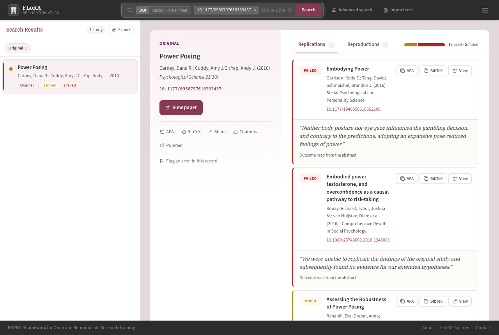
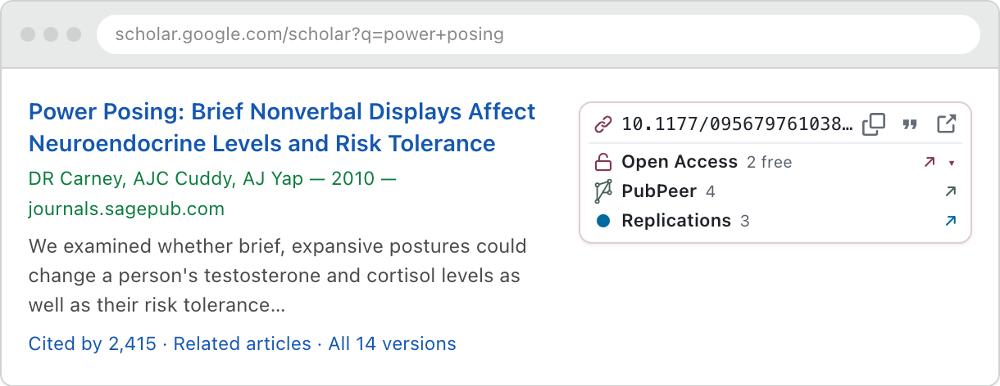
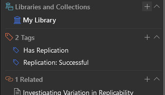
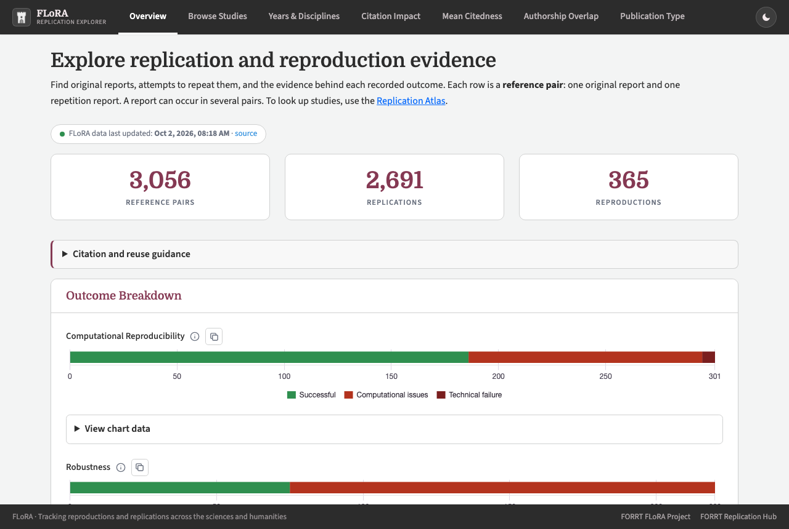
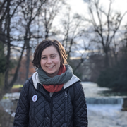
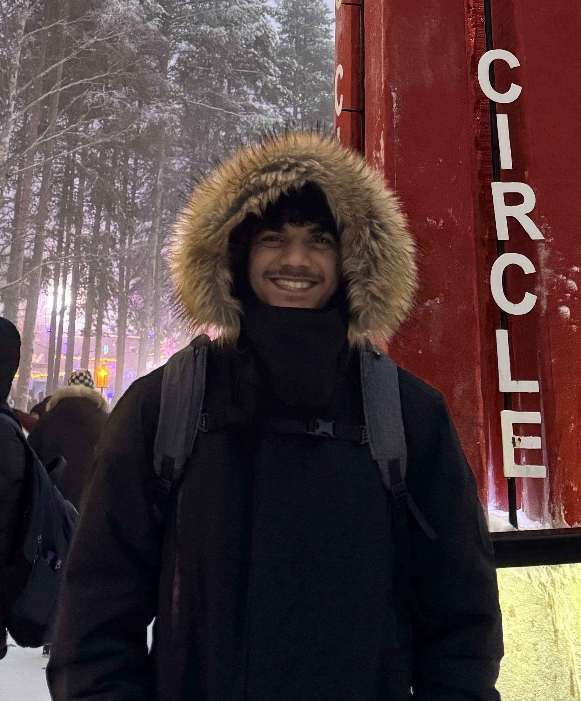
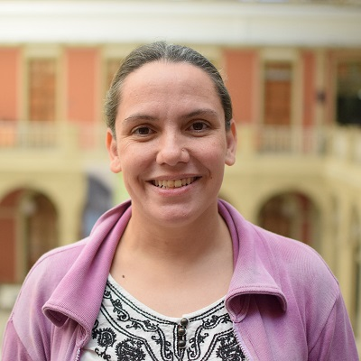

::: hero
[MAKING REPLICATIONS]{.hero-white} [COUNT]{.hero-black}
:::

::: lead
Replications are the foundation of a healthy science, but they often go unnoticed. *Making Replications Count* is a UKRI-funded project that builds tools to make replication attempts visible where researchers search, read and cite, and studies when and why replications are overlooked.
:::

## Tools

All tools draw on [FLoRA](https://forrt.org/replication-hub/flora/), FORRT's open database of replication and reproduction attempts.

:::::: tool-grid
::::: tool-card
[{fig-alt="Replication Atlas showing three replications of a power-posing study"}](https://forrt.org/flora-replication-atlas/)

### Replication Atlas

Check whether a study has been replicated. Search by DOI, title or author, or paste a whole reference list to check every cited study at once.

[Open the Atlas](https://forrt.org/flora-replication-atlas/){.btn .btn-primary}
:::::

::::: tool-card
{.fit-contain fig-alt="Google Scholar result with an ORE panel listing open access, PubPeer and replications"}

### Browser extension: FORRT ORE

For Chrome and Edge. On article pages and in search results (e.g., Google Scholar, PubMed, OpenAlex) it shows replications, retractions, PubPeer discussions and open-access versions next to each paper.

[Add to Chrome](https://chromewebstore.google.com/detail/kdbmghoddafabpjdnjhocollhjefcnco){.btn .btn-primary} [Docs](https://forrt.org/chromium-extension/){.btn .btn-outline-primary}
:::::

::::: tool-card
{.fit-contain .dark-bg fig-alt="Zotero item tagged 'Has Replication' and 'Replication: Successful'"}

### Replication Checker for Zotero

Scan your Zotero library for studies with known replications. The plug-in tags affected items, adds notes with the outcomes and can add the replications to your library. Your library contents stay on your machine.

[Download](https://github.com/forrtproject/flora-zotero/releases/latest){.btn .btn-primary} [Docs](https://forrt.org/flora-zotero/){.btn .btn-outline-primary}
:::::

::::: tool-card
[{fig-alt="FLoRA Explorer overview with counts of replications and reproductions"}](https://forrt.org/flora-explorer/)

### FLoRA Explorer

Explore the whole database: replication outcomes by year and discipline, and citation patterns of original studies after they were replicated.

[Open the Explorer](https://forrt.org/flora-explorer/){.btn .btn-primary}
:::::
::::::

## Studies

::::: study-list
::: study
### Bibliometric study

How do failed replications affect the reception of the original studies?

[Preregistration](https://doi.org/10.17605/OSF.IO/WJGM3){.study-link} *(When) Do Replications Influence the Impact of Original Claims? A Bibliometric Investigation*
:::

::: study
### Preprint notifications (FLoRA Notify)

Are notifications about replications helpful for researchers?

[Registered protocol](https://doi.org/10.31222/osf.io/qnckf_v1){.study-link} *FLoRA-Notify: A Protocol for a Cluster-Randomised Controlled Trial to Assess the Impact of Notifying Preprint Authors About Replication Studies*

[Code](https://github.com/forrtproject/flora-preprint-notifier) · [Privacy notice](privacy.qmd)
:::

::: study
### Mixed-methods study

How do researchers decide which studies to read and cite?

[Preregistration](https://doi.org/10.17605/OSF.IO/PEVZF){.study-link} *When Replication Meets Practice: A qualitative study of how researchers search for, integrate and anticipate pushback on replication evidence* (qualitative part)
:::
:::::

**Overview paper:** [Tracking and mainstreaming replications in the social, cognitive, and behavioral sciences](https://doi.org/10.31222/osf.io/ad2w6_v5) (MetaArXiv preprint).

## Who we are

```{=html}
<div class="people">
  <figure><figcaption><strong>Lukas Wallrich</strong>Principal Investigator</figcaption></figure>
  <figure><figcaption><strong>Lukas (Luke) Röseler</strong>Co-Principal Investigator</figcaption></figure>
  <figure><figcaption><strong>Flávio Azevedo</strong>Co-Investigator</figcaption></figure>
  <figure><figcaption><strong>Josefina Weinerova</strong>Postdoctoral Researcher</figcaption></figure>
  <figure><figcaption><strong>Keegan Vaz</strong>Research Assistant</figcaption></figure>
  <figure><figcaption><strong>Hamidreza Behbood</strong>Research Assistant</figcaption></figure>
  <figure><figcaption><strong>Rohan Tondlekar</strong>Research Assistant</figcaption></figure>
</div>
```

### Advisory board

```{=html}
<div class="people">
  <figure><figcaption><strong>Yanina Bellini Saibene</strong>rOpenSci, R-Ladies</figcaption></figure>
  <figure><figcaption><strong>Prof Stefan Feuerriegel</strong>LMU Munich</figcaption></figure>
  <figure><figcaption><strong>Prof Lisa DeBruine</strong>University of Glasgow</figcaption></figure>
  <figure><figcaption><strong>Prof Julie Gore</strong>Birkbeck, University of London</figcaption></figure>
  <figure><figcaption><strong>Dr Crystal Steltenpohl</strong>Center for Open Science</figcaption></figure>
  <figure><figcaption><strong>Dr Madeleine Pownall</strong>University of Leeds</figcaption></figure>
</div>
```

### Hackathons

We run hackathons at the Münster Center for Open Science, where researchers and developers build tools on FLoRA. Read more in [*Did you know this study was replicated?*](https://researchonresearchinstitute.substack.com/p/did-you-know-this-study-was-replicated) on the Research on Research Institute blog.

::: next-event
**Next: Fall Hackathon, 11–13 November 2026, Münster**

[Event page](https://indico.uni-muenster.de/event/4370/){.btn .btn-primary} [Project ideas](https://mrc-hackathon-projects.surge.sh/){.btn .btn-outline-primary}
:::

:::: {.hackathon-photos layout-ncol="2"}
). Photo: MüCOS.](images/hackathon/spring2026_group_photo.jpg)

).](images/hackathon/autumn2025_group_photo.jpg)
::::

## Partners

```{=html}
<div class="logos">
  <a href="https://www.bbk.ac.uk/"></a>
  <a href="https://www.uni-muenster.de/"></a>
  <a href="https://www.uni-muenster.de/MueCOS/en/index.html"></a>
  <a href="https://forrt.org"></a>
</div>
<p class="funder-label">Funded by</p>
<div class="logos">
  <a href="https://www.ukri.org/"></a>
</div>
```
