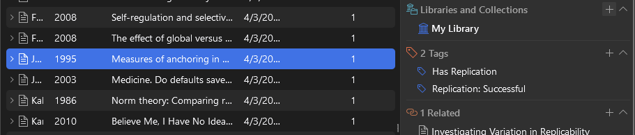

::: {.title-banner style="background-color: #7B4B94; padding: 0.5rem 2rem; text-align: center; margin-bottom: 1rem;"}
[MAKING REPLICATIONS]{style="color: white; font-size: 2.5rem; font-weight: bold; letter-spacing: 0.05em;"} [COUNT]{style="color: black; font-size: 2.5rem; font-weight: bold; letter-spacing: 0.05em;"}
:::

*A UKRI-funded project to increase the visibility of replication attempts.*

{fig-align="center"}

## WHAT IS THE PROJECT GOAL?

Replications are the foundation of a healthy science. With our projects, we try to increase the visibility of replications and investigate the conditions under which they go unnoticed.

{fig-align="center"}

## HACKATHONS

We run hackathons at the Münster Center for Open Science, where researchers and developers build tools on FLoRA, the [FORRT Library of Replication Attempts](https://forrt.org/replication-hub/flora/).

**Fall Hackathon: 11–13 November 2026, Münster.** [Event page](https://indico.uni-muenster.de/event/4370/){.btn .btn-primary} [Project ideas](https://mrc-hackathon-projects.surge.sh/){.btn .btn-outline-primary}

:::: {layout-ncol="2"}
). Photo: MüCOS.](images/hackathon/spring2026_group_photo.jpg)

).](images/hackathon/autumn2025_group_photo.jpg)
::::

Read more about the hackathons and the tools built there in [*Did you know this study was replicated?*](https://researchonresearchinstitute.substack.com/p/did-you-know-this-study-was-replicated) on the Research on Research Institute blog.

{fig-align="center"}

## STUDIES

-   **Bibliometric Study**: How do failed replications affect the reception of the original studies?\
    [Preregistration](https://doi.org/10.17605/OSF.IO/WJGM3): *(When) Do Replications Influence the Impact of Original Claims? A Bibliometric Investigation.*

-   **Preprint Notifications (FLoRA Notify)**: Are notifications about replications helpful for researchers?\
    [Registered protocol](https://doi.org/10.31222/osf.io/qnckf_v1): *FLoRA-Notify: A Protocol for a Cluster-Randomised Controlled Trial to Assess the Impact of Notifying Preprint Authors About Replication Studies* · [Code](https://github.com/forrtproject/flora-preprint-notifier) · [Privacy notice](privacy.qmd)

-   **Mixed-Methods Study**: How do researchers decide which studies to read and cite?\
    [Preregistration of the qualitative study](https://doi.org/10.17605/OSF.IO/PEVZF): *When Replication Meets Practice: A qualitative study of how researchers search for, integrate and anticipate pushback on replication evidence.*

-   **Wikipedia audit**: How often do Wikipedia articles that cite an original study also cite its replications?\
    [The Replication Gap](https://lukaswallrich.github.io/flora-wikipedia/): suggested edits for Wikipedia articles that miss replication evidence.

**Overview paper:** [Tracking and mainstreaming replications in the social, cognitive, and behavioral sciences](https://doi.org/10.31222/osf.io/ad2w6_v5) (MetaArXiv preprint).

{fig-align="center"}

## TOOLS

All tools draw on [FLoRA](https://forrt.org/replication-hub/flora/), FORRT's open database of replication and reproduction attempts.

### Replication Atlas

Check whether a study has been replicated. Search by DOI, title or author, or paste a whole reference list to check every cited study at once.

[{.border}](https://forrt.org/flora-replication-atlas/)

[Open the Replication Atlas](https://forrt.org/flora-replication-atlas/){.btn .btn-primary}

### Replication Checker for Zotero

Scan your Zotero library for studies with known replications. The plug-in tags affected items, adds notes with the replication outcomes and can add the replications to your library. Matching uses hash prefixes, so your library contents stay on your machine.

{.border}

[About the plug-in](https://forrt.org/flora-zotero/){.btn .btn-primary} [Download](https://github.com/forrtproject/flora-zotero/releases/latest){.btn .btn-outline-primary}

### FORRT ORE — Open Research Extension

A browser extension for Chrome and Edge. On article pages and in search results (e.g., Google Scholar, PubMed, OpenAlex) it shows replications, retractions, PubPeer discussions and open-access versions next to each paper.

:::: {layout-ncol="2"}

::::

[About the extension](https://forrt.org/chromium-extension/){.btn .btn-primary}

### FLoRA Explorer

Explore the whole database: replication outcomes by year and discipline, and citation patterns of original studies after they were replicated.

[{.border}](https://forrt.org/flora-explorer/)

[Open the FLoRA Explorer](https://forrt.org/flora-explorer/){.btn .btn-primary}

{fig-align="center"}

## WHO ARE WE?

::: {layout-ncol="3"}
{height="150"}

{height="150"}

{height="150"}

{height="150"}

{height="150"}

{height="150"}

{height="150"}
:::

### Advisory Board

::: {layout-ncol="3"}
{height="150"}

{height="150"}

{height="150"}

{height="150"}

{height="150"}

{height="150"}
:::

{fig-align="center"}

## 

::::: {layout-ncol="2"}

## Institutions

{height="60"}

[{height="60"}](https://www.uni-muenster.de/MueCOS/en/index.html)

{height="60"}

[{height="60"}](https://forrt.org)

## Funder

[{height="80"}](https://www.ukri.org/)

:::::
